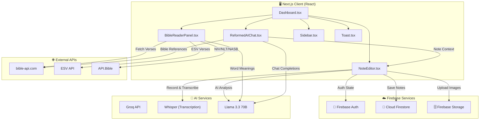
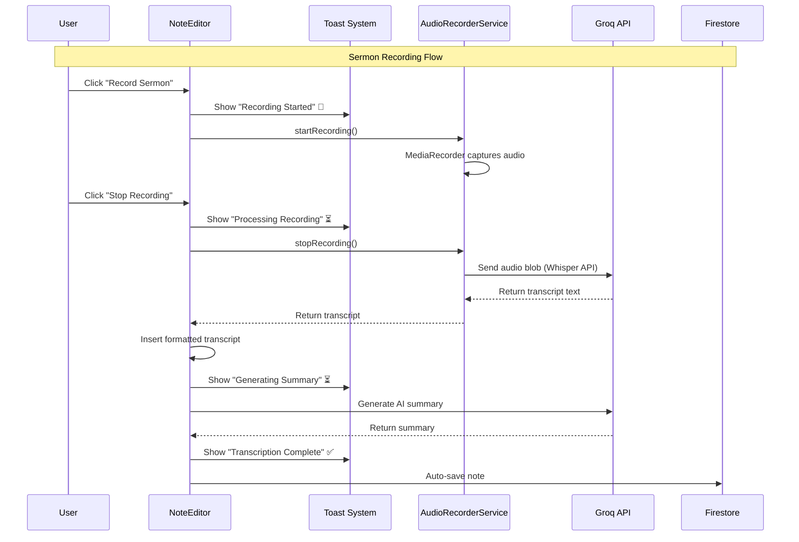
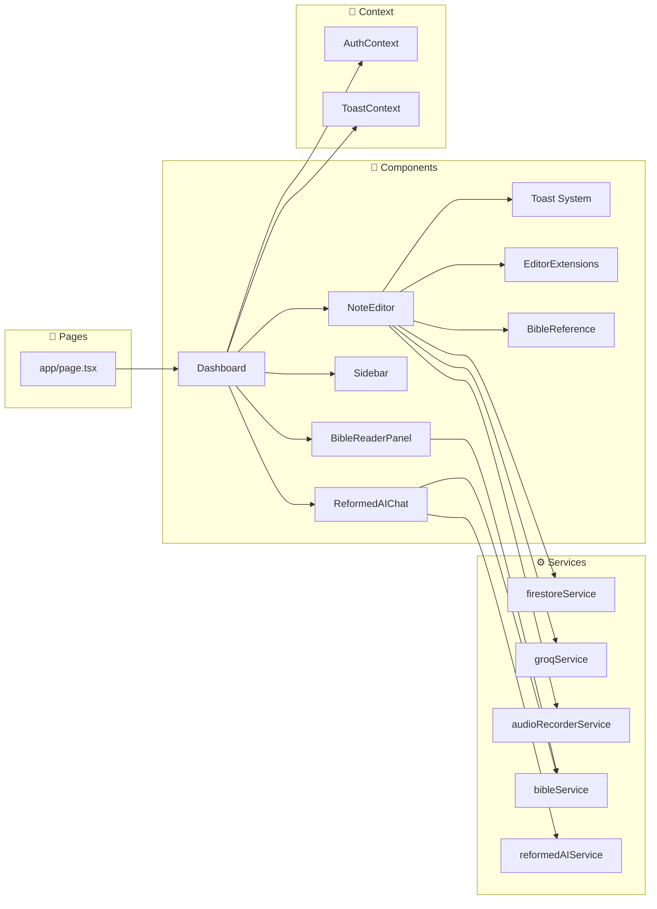
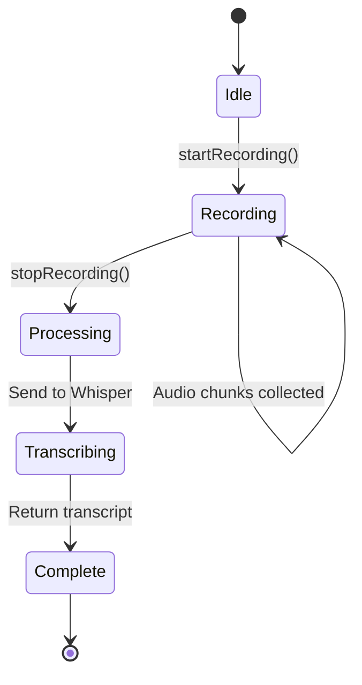
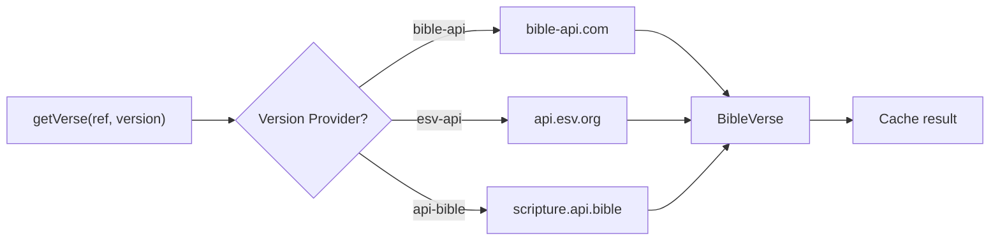
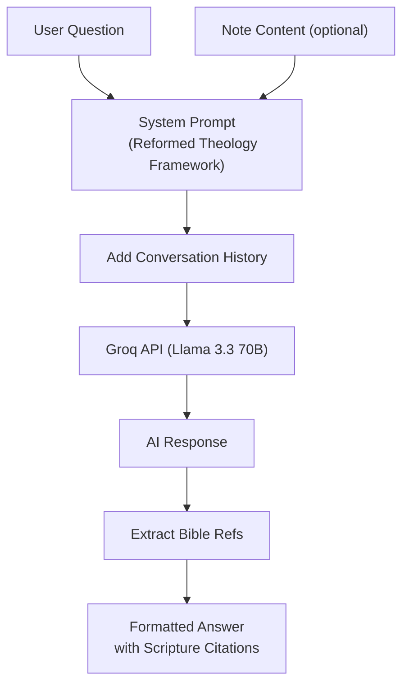
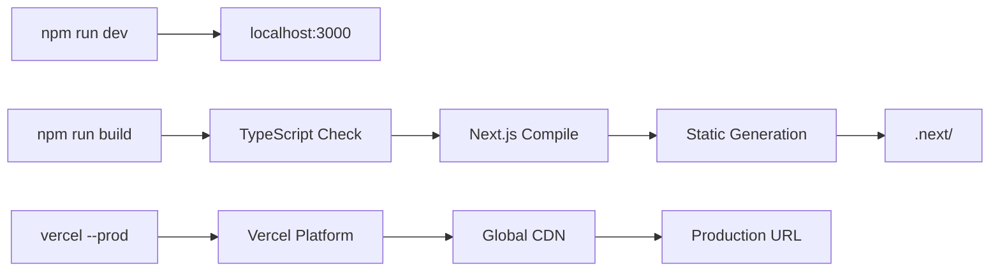

# Technical Documentation

## Architecture Overview

WordFlow is a **Next.js 15 (App Router)** application built with a **Serverless** architecture using Firebase and AI-powered services.

---

## System Architecture



---

## Data Flow Diagram



---

## Component Architecture



---

## Key Components

### 1. NoteEditor (`src/components/NoteEditor.tsx`)
The core rich-text editor built with Tiptap/ProseMirror with Notion-like features.

| Feature | Implementation |
|---------|---------------|
| **Rich Text Editing** | Tiptap with StarterKit, Highlight, Underline, TextAlign |
| **Slash Commands** | Type `/` to insert blocks (headings, lists, tables, code, callouts) |
| **Tables** | Full table support with add/delete rows & columns via floating menu |
| **Task Lists** | Interactive checkboxes with strikethrough on completion |
| **Toggle Blocks** | Collapsible content sections (Details/Summary) |
| **Callouts** | Info, Warning, Success, Error callout boxes with icons |
| **Code Blocks** | Syntax highlighting via lowlight |
| **Tab Indentation** | Tab/Shift+Tab for indent/outdent in paragraphs and lists |
| **Text Alignment** | Left, Center, Right, and **Justify** options |
| **Subscript/Superscript** | For footnotes and mathematical notation |
| **Auto-Save** | Debounced (1s) save to Firestore |
| **Bible References** | Custom extension with regex detection + API lookup |
| **Image Handling** | Paste detection → Firebase Storage upload |
| **Sermon Recording** | MediaRecorder API → Groq Whisper transcription |
| **AI Analysis** | Groq Llama 3.3 for sermon summarization |
| **Toast Notifications** | Modern popup system for all status updates |

### 2. Sidebar (`src/components/Sidebar.tsx`)
Collapsible navigation sidebar with tools access.

| Feature | Implementation |
|---------|---------------|
| **Collapse Toggle** | Shrinks to 60px icon-only view |
| **Folder Navigation** | Create, delete, select folders |
| **Tool Buttons** | Quick access to Bible Reader and AI Chat |
| **User Profile** | Display user info with logout option |

### 3. BibleReaderPanel (`src/components/BibleReaderPanel.tsx`)
Split-screen Bible reader with multiple version support.

| Feature | Implementation |
|---------|---------------|
| **Versions** | ESV, NIV, NLT, NASB, NKJV, KJV, WEB, ASV, BBE, DARBY, YLT |
| **Navigation** | Book/chapter browser with prev/next arrows |
| **Book Search** | Type-to-filter book picker (e.g., "Titus") |
| **Word Meanings** | Click word → AI-powered Greek/Hebrew lookup |
| **Verse Insert** | Click verse → Insert formatted blockquote in editor |
| **AI Search** | AI-powered topical verse search |
| **Expand Mode** | Toggle between 400px and 600px width |

### 4. ReformedAIChat (`src/components/ReformedAIChat.tsx`)
Theological AI assistant with Reformed evangelical perspective.

| Feature | Implementation |
|---------|---------------|
| **Persona** | Reformed theology (5 Solas, TULIP, Covenant Theology) |
| **Note Context** | Receives current note content for contextual responses |
| **Context Indicator** | Shows "Note Context Active" badge when viewing a note |
| **Smart Questions** | Different quick questions based on context |
| **Bible References** | Automatic Scripture citations in responses |
| **Word Definitions** | Double-click word for theological definition |
| **Verse Linking** | Clickable verse refs → Insert into notes |

### 5. Toast (`src/components/Toast.tsx`)
Modern notification system for status updates.

| Feature | Implementation |
|---------|---------------|
| **Types** | success, error, info, loading, bible, recording, saving, upload |
| **Auto-dismiss** | Configurable duration (default 4s, loading = persistent) |
| **Animations** | Slide-in from right with blur backdrop |
| **Actions** | Optional action buttons in toasts |
| **Updates** | Can update loading toasts to success/error |

---

## Services Architecture

### AudioRecorderService


### BibleService


### ReformedAIService


---

## Data Models

### Notes Collection (`notes`)
```typescript
interface Note {
  id: string;           // Auto-generated UUID
  userId: string;       // Firebase Auth UID
  folderId: string | null;
  title: string;
  content: string;      // HTML (Tiptap output)
  createdAt: Timestamp;
  updatedAt: Timestamp;
}
```

### Folders Collection (`folders`)
```typescript
interface Folder {
  id: string;
  userId: string;
  title: string;
  createdAt: Timestamp;
}
```

### Toast Interface
```typescript
interface Toast {
  id: string;
  title: string;
  message?: string;
  type: 'success' | 'error' | 'info' | 'loading' | 'bible' | 'recording' | 'saving' | 'upload';
  duration?: number;  // 0 = persistent
  action?: {
    label: string;
    onClick: () => void;
  };
}
```

---

## Environment Variables

| Variable | Required | Description |
|----------|----------|-------------|
| `NEXT_PUBLIC_FIREBASE_API_KEY` | ✅ | Firebase project API key |
| `NEXT_PUBLIC_FIREBASE_AUTH_DOMAIN` | ✅ | Firebase auth domain |
| `NEXT_PUBLIC_FIREBASE_PROJECT_ID` | ✅ | Firebase project ID |
| `NEXT_PUBLIC_FIREBASE_STORAGE_BUCKET` | ✅ | Firebase storage bucket |
| `NEXT_PUBLIC_FIREBASE_MESSAGING_SENDER_ID` | ✅ | Firebase messaging ID |
| `NEXT_PUBLIC_FIREBASE_APP_ID` | ✅ | Firebase app ID |
| `NEXT_PUBLIC_GROQ_API_KEY` | ✅ | Groq API key for AI features |
| `NEXT_PUBLIC_ESV_API_KEY` | ⚪ | Optional: For ESV Bible version |
| `NEXT_PUBLIC_API_BIBLE_KEY` | ⚪ | Optional: For NIV/NLT/NASB/NKJV |

---

## Security Considerations

### Firebase Security Rules
```javascript
rules_version = '2';
service cloud.firestore {
  match /databases/{database}/documents {
    // Notes: User can only access their own notes
    match /notes/{noteId} {
      allow read, write: if request.auth != null 
        && request.auth.uid == resource.data.userId;
      allow create: if request.auth != null 
        && request.auth.uid == request.resource.data.userId;
    }
    
    // Folders: User can only access their own folders
    match /folders/{folderId} {
      allow read, write: if request.auth != null 
        && request.auth.uid == resource.data.userId;
      allow create: if request.auth != null 
        && request.auth.uid == request.resource.data.userId;
    }
  }
}
```

### API Key Protection
- All `NEXT_PUBLIC_*` variables are exposed to the client
- Firebase API keys are protected by Firebase Security Rules
- Groq API calls are made client-side (consider server-side proxy for production)

---

## Build & Deployment



### Commands
```bash
# Development
npm run dev

# Production build
npm run build

# Deploy to Vercel
npx vercel --prod
```

---

## Changelog (Recent Updates)

### v1.2.0 - January 2026
- ✅ **Collapsible Sidebar** - Toggle to icon-only mode
- ✅ **AI Note Context** - Reformed AI can analyze current note
- ✅ **Toast Notifications** - Modern popup system for status updates
- ✅ **Bible Book Search** - Filter books by typing
- ✅ **Bible Reader Scrolling** - Fixed scroll issues

### v1.1.0 - December 2025
- ✅ **Notion-like Features** - Slash commands, tables, task lists, callouts
- ✅ **Code Blocks** - Syntax highlighting with lowlight
- ✅ **Text Justify** - Added justify alignment option
- ✅ **Tab Indentation** - Tab/Shift+Tab for indentation
