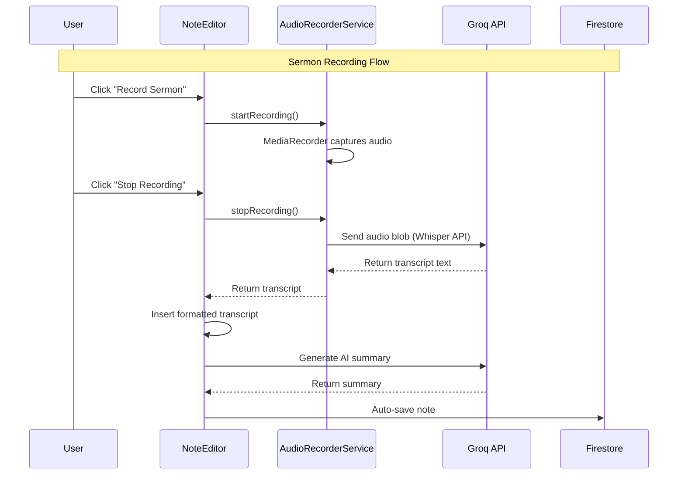
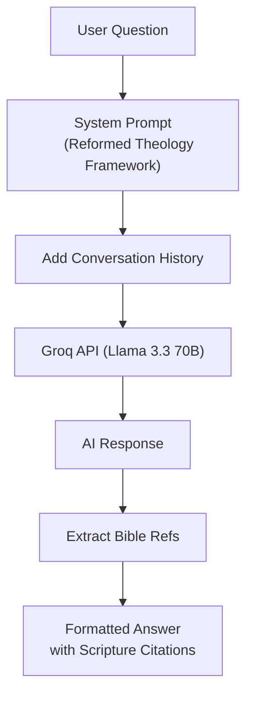

# Technical Documentation

## Architecture Overview

Word Flow is a **Next.js 16 (App Router)** application built with a **Serverless** architecture using Firebase and AI-powered services.

---

## System Architecture

```mermaid
flowchart TB
    subgraph Client["🖥️ Next.js Client (React)"]
        Dashboard["Dashboard.tsx"]
        NoteEditor["NoteEditor.tsx"]
        BibleReader["BibleReaderPanel.tsx"]
        AIChat["ReformedAIChat.tsx"]
        Sidebar["Sidebar.tsx"]
    end

    subgraph Firebase["☁️ Firebase Services"]
        Auth["🔐 Firebase Auth"]
        Firestore["📄 Cloud Firestore"]
        Storage["🗄️ Firebase Storage"]
    end

    subgraph AI["🤖 AI Services"]
        Groq["Groq API"]
        Whisper["Whisper (Transcription)"]
        Llama["Llama 3.3 70B"]
    end

    subgraph External["🌐 External APIs"]
        BibleAPI["bible-api.com"]
        ESVAPI["ESV API"]
        APIBible["API.Bible"]
    end

    Dashboard --> NoteEditor
    Dashboard --> BibleReader
    Dashboard --> AIChat
    Dashboard --> Sidebar

    NoteEditor -->|"Auth State"| Auth
    NoteEditor -->|"Save Notes"| Firestore
    NoteEditor -->|"Upload Images"| Storage
    NoteEditor -->|"Record & Transcribe"| Whisper
    NoteEditor -->|"AI Analysis"| Llama

    BibleReader -->|"Fetch Verses"| BibleAPI
    BibleReader -->|"ESV Verses"| ESVAPI
    BibleReader -->|"NIV/NLT/NASB"| APIBible
    BibleReader -->|"Word Meanings"| Llama

    AIChat -->|"Chat Completions"| Llama
    AIChat -->|"Bible References"| BibleAPI
```



---

## Data Flow Diagram



---

## Component Architecture

```mermaid
graph LR
    subgraph Pages["📄 Pages"]
        App["app/page.tsx"]
    end

    subgraph Components["🧩 Components"]
        Dashboard
        NoteEditor
        Sidebar
        BibleReader["BibleReaderPanel"]
        AIChat["ReformedAIChat"]
        Extensions["EditorExtensions"]
        BibleRef["BibleReference"]
    end

    subgraph Services["⚙️ Services"]
        FirestoreService["firestoreService"]
        GroqService["groqService"]
        AudioService["audioRecorderService"]
        BibleService["bibleService"]
        ReformedAI["reformedAIService"]
    end

    subgraph Context["🔄 Context"]
        AuthContext["AuthContext"]
    end

    App --> Dashboard
    Dashboard --> Sidebar
    Dashboard --> NoteEditor
    Dashboard --> BibleReader
    Dashboard --> AIChat

    NoteEditor --> Extensions
    NoteEditor --> BibleRef
    NoteEditor --> GroqService
    NoteEditor --> AudioService
    NoteEditor --> FirestoreService

    BibleReader --> BibleService
    AIChat --> ReformedAI
    AIChat --> BibleService

    Dashboard --> AuthContext
```



---

## Key Components

### 1. NoteEditor (`src/components/NoteEditor.tsx`)
The core rich-text editor built with Tiptap/ProseMirror with Notion-like features.

| Feature | Implementation |
|---------|---------------|
| **Rich Text Editing** | Tiptap with StarterKit, Highlight, Underline, TextAlign |
| **Slash Commands** | Type `/` to insert blocks (headings, lists, tables, code, callouts) |
| **Tables** | Full table support with add/delete rows & columns via floating menu |
| **Task Lists** | Interactive checkboxes with strikethrough on completion |
| **Toggle Blocks** | Collapsible content sections (Details/Summary) |
| **Callouts** | Info, Warning, Success, Error callout boxes with icons |
| **Code Blocks** | Syntax highlighting via lowlight |
| **Tab Indentation** | Tab/Shift+Tab for indent/outdent in paragraphs and lists |
| **Text Alignment** | Left, Center, Right, and **Justify** options |
| **Subscript/Superscript** | For footnotes and mathematical notation |
| **Auto-Save** | Debounced (2s) save to Firestore |
| **Bible References** | Custom extension with regex detection + API lookup |
| **Image Handling** | Paste detection → Firebase Storage upload |
| **Sermon Recording** | MediaRecorder API → Groq Whisper transcription |
| **AI Analysis** | Groq Llama 3.3 for sermon summarization |

### 2. BibleReaderPanel (`src/components/BibleReaderPanel.tsx`)
Split-screen Bible reader with multiple version support.

| Feature | Implementation |
|---------|---------------|
| **Versions** | ESV, NIV, NLT, NASB, NKJV, KJV, WEB, ASV, BBE, DARBY, YLT |
| **Navigation** | Book/chapter browser with prev/next arrows |
| **Word Meanings** | Click word → AI-powered Greek/Hebrew lookup |
| **Verse Insert** | Click verse → Insert formatted blockquote in editor |
| **Search** | AI-powered topical verse search |

### 3. ReformedAIChat (`src/components/ReformedAIChat.tsx`)
Theological AI assistant with Reformed evangelical perspective.

| Feature | Implementation |
|---------|---------------|
| **Persona** | Reformed theology (5 Solas, TULIP, Covenant Theology) |
| **Bible References** | Automatic Scripture citations in responses |
| **Word Definitions** | Double-click word for theological definition |
| **Verse Linking** | Clickable verse refs → Insert into notes |

---

## Services Architecture

### AudioRecorderService


### BibleService


### ReformedAIService


---

## Data Models

### Notes Collection (`notes`)
```typescript
interface Note {
  id: string;           // Auto-generated UUID
  userId: string;       // Firebase Auth UID
  folderId: string | null;
  title: string;
  content: string;      // HTML (Tiptap output)
  createdAt: Timestamp;
  updatedAt: Timestamp;
}
```

### Folders Collection (`folders`)
```typescript
interface Folder {
  id: string;
  userId: string;
  title: string;
  createdAt: Timestamp;
}
```

---

## Environment Variables

| Variable | Required | Description |
|----------|----------|-------------|
| `NEXT_PUBLIC_FIREBASE_API_KEY` | ✅ | Firebase project API key |
| `NEXT_PUBLIC_FIREBASE_AUTH_DOMAIN` | ✅ | Firebase auth domain |
| `NEXT_PUBLIC_FIREBASE_PROJECT_ID` | ✅ | Firebase project ID |
| `NEXT_PUBLIC_FIREBASE_STORAGE_BUCKET` | ✅ | Firebase storage bucket |
| `NEXT_PUBLIC_FIREBASE_MESSAGING_SENDER_ID` | ✅ | Firebase messaging ID |
| `NEXT_PUBLIC_FIREBASE_APP_ID` | ✅ | Firebase app ID |
| `NEXT_PUBLIC_GROQ_API_KEY` | ✅ | Groq API key for AI features |
| `NEXT_PUBLIC_ESV_API_KEY` | ⚪ | Optional: For ESV Bible version |
| `NEXT_PUBLIC_API_BIBLE_KEY` | ⚪ | Optional: For NIV/NLT/NASB/NKJV |

---

## Security Considerations

### Firebase Security Rules
```javascript
rules_version = '2';
service cloud.firestore {
  match /databases/{database}/documents {
    // Notes: User can only access their own notes
    match /notes/{noteId} {
      allow read, write: if request.auth != null 
        && request.auth.uid == resource.data.userId;
      allow create: if request.auth != null 
        && request.auth.uid == request.resource.data.userId;
    }
    
    // Folders: User can only access their own folders
    match /folders/{folderId} {
      allow read, write: if request.auth != null 
        && request.auth.uid == resource.data.userId;
      allow create: if request.auth != null 
        && request.auth.uid == request.resource.data.userId;
    }
  }
}
```

### API Key Protection
- All `NEXT_PUBLIC_*` variables are exposed to the client
- Firebase API keys are protected by Firebase Security Rules
- Groq API calls are made client-side (consider server-side proxy for production)

---

## Build & Deployment


### Commands
```bash
# Development
npm run dev

# Production build
npm run build

# Deploy to Vercel
npx vercel --prod
```
